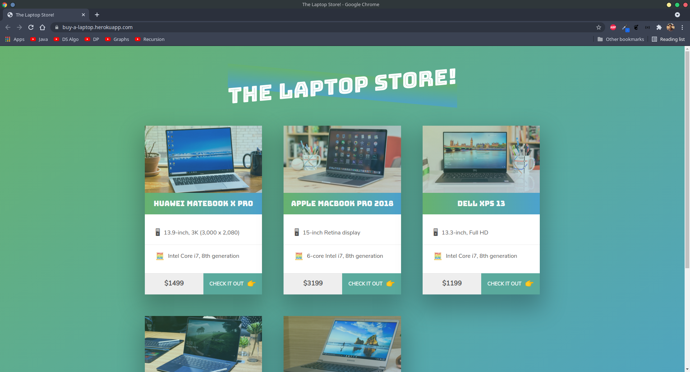

<h1 style="text-align:center;">The Laptop Store 💻</h1>
  
  [](https://opensource.org/licenses/MIT)

- **The Laptop Store** is a Laptop buying guide Application.
- The app is developed in HTML, CSS & Javascript. NodeJs is used as a runtime environment for JS.
- This porject is a part of Javascript course on Udemy by *Jonas Schmedtmann*.
- Try the website [here.](https://buy-a-laptop.herokuapp.com/)
  
  ***


## Table of Contents
- [Table of Contents](#table-of-contents)
- [Features](#features)
- [Screenshots](#screenshots)
- [Getting Started](#getting-started)
- [License](#license)

***

## Features
Following features have been implemented:

- [x] Search over different laptops
- [x] View details about every laptop
- [x] Beautiful UI & UX Designs
  
***

## Screenshots
|Screen Name | Screenshots |
|---|--|
|Home Page||

***

## Getting Started
Clone the repository on your local machine.

```bash
git clone git@github.com:imKashyap/The-Laptop-Store.git
cd The-Laptop-Store
npm i
npm run start
```

Make sure you see the following screen:


## License
 This repository is licensed under [MIT.](https://github.com/imKashyap/The-Laptop-Store/blob/main/LICENSE)
 
 Do fork and star :star: the repo if you find it appreciable.
